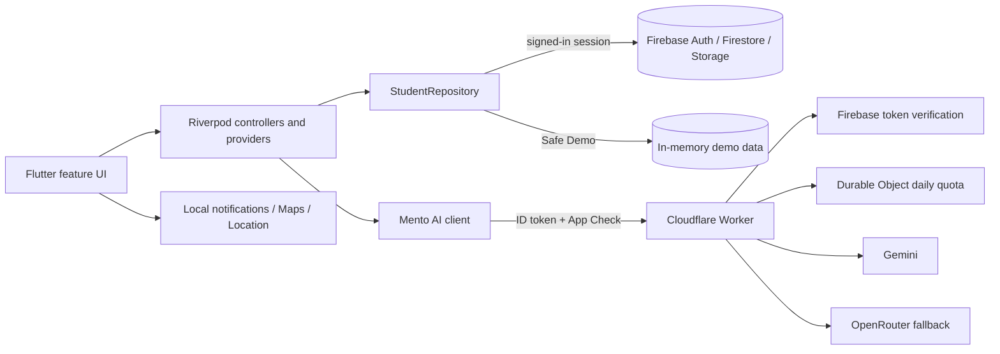

<p align="center">
  
</p>

<h1 align="center">Mento</h1>

<p align="center">
  A calm, AI-assisted study and student-lifestyle companion for Android and iOS.
</p>

<p align="center">
  
  
  
  
</p>

Mento brings academic planning, focused work, wellbeing, progress tracking, and an AI study assistant into one responsive Flutter application. Signed-in data is isolated per Firebase user; a memory-only Safe Demo lets contributors explore the main experience without writing anything to Firebase.

> [!IMPORTANT]
> Mento's AI output is advisory. Generated plans and proposed data changes are validated and shown for review; the assistant cannot silently mutate a student's records.

## Highlights

| Area | What is implemented |
| --- | --- |
| Today dashboard | Today's task progress, next event, nearest deadline, streak, priority-based next action, accepted study blocks, habits, and quick links |
| Academic organiser | Agenda, day, week, month, deadlines, and modules views; search, filtering, and sorting; modules, topics, timetable events, assignments, exams, and study tasks |
| Smart planning | Structured AI plans with editable/selectable blocks, strict response validation, conflict-aware scheduling, and a deterministic offline fallback |
| Mento assistant | Synced conversation history, bounded academic context, local fast-path answers, cancellation, and explicit confirmation for supported create/update/delete proposals |
| Focus | Goal- and module-linked focus/break timers, pause/resume, background-safe elapsed-time calculation, history, and completion reminders |
| Habits and wellbeing | Habit tracking, optional non-clinical mood/energy/sleep check-ins, trends, and bulk deletion of wellness records |
| Progress | Points, levels, achievements, streaks, focus totals, assignment/task completion, and topic-mastery summaries |
| Study locations | Manually saved places, an optional Google Map, one-time current-location capture, and external directions |
| Accounts and preferences | Email/password, Google, optional Apple sign-in, email verification, onboarding, profile photos, light/dark/system themes, reduced motion, privacy controls, and account deletion |
| Resilience and accessibility | Safe Demo, offline banners, loading/error/empty states, responsive phone/tablet layouts, semantic control identifiers, and large-text layout tests |

## Safe Demo

Choose **Explore safe demo** on the sign-in screen to load a deterministic sample workspace.

- Demo records live only in memory and never touch Firebase.
- Changes disappear when the demo repository is discarded or the app restarts.
- Assistant responses are generated locally and are clearly labelled.
- Study-plan generation uses the deterministic offline planner.
- The same repository interface powers both demo and signed-in sessions, so the demo exercises the real feature screens rather than a separate mock UI.

## Architecture



The mobile app follows a feature-first structure with shared domain models and a repository boundary:

```text
lib/
├── app/                    # Bootstrap, routing, responsive layout, and themes
├── core/                   # Configuration, deterministic logic, services, network, widgets
├── data/
│   ├── models/             # Firestore-friendly domain models
│   └── repositories/       # Repository contract, Firestore, and Safe Demo implementations
└── features/               # UI and controllers grouped by product feature

worker/
├── src/                    # Authenticated AI proxy, schemas, providers, quota, logging
└── test/                   # Worker, provider, auth, quota, schema, and safety tests

firestore-tests/            # Firestore and Storage rules test suites
integration_test/           # End-to-end Safe Demo academic flow
tool/                       # iOS configuration and Firebase Test Lab utilities
```

### Mobile layers

- **Presentation:** responsive Material widgets and `go_router` navigation.
- **Application:** Riverpod providers/controllers coordinate streams, timers, forms, and commands.
- **Domain/core:** deterministic scheduling, priority scoring, progress, gamification, validation, and conflict detection.
- **Data:** `StudentRepository` keeps UI code independent of Firestore and switches to `DemoStudentRepository` for Safe Demo.

### AI request path

1. The app builds a bounded academic snapshot and removes sensitive fields such as email, phone, user IDs, tokens, and exact coordinates.
2. `MentoAiClient` sends the request to the Worker with a Firebase ID token, Firebase App Check token, and traceable request ID.
3. The Worker verifies authentication and optional app attestation, rejects credentials in request content, enforces strict Zod schemas, and atomically consumes a per-user daily quota.
4. Gemini is attempted first, followed by configured Gemini fallback models and then OpenRouter where appropriate.
5. Provider output is validated again before returning to Flutter. Plans receive an additional client-side validation pass.
6. Assistant data actions remain proposals until the user confirms each one in the app.

## Technology stack

- Flutter and Dart
- Riverpod for state management
- `go_router` for guarded navigation
- Firebase Authentication, Cloud Firestore, Cloud Storage, and App Check
- Google, optional Apple, and email/password authentication
- Cloudflare Workers and a SQLite-backed Durable Object for quota enforcement
- TypeScript, Zod, Jose, Vitest, and Wrangler in the AI gateway
- Gemini with optional model fallbacks and OpenRouter fallback
- Google Maps, Geolocator, local notifications, and timezone-aware scheduling

## Prerequisites

Install the tools needed for the parts of the repository you intend to run:

- Flutter **3.29.3** with Dart **3.7.2** (or a compatible newer stable toolchain satisfying `sdk: ^3.7.2`)
- Android Studio/Android SDK for Android development
  - compile SDK 36
  - minimum SDK 23
  - NDK `27.0.12077973`
  - JDK 17-23 (17 is the safest default for the current Android tooling)
- macOS with Xcode for iOS development; the project targets iOS 15+
- Node.js **22+** and npm for the Worker and Firebase rules tests
- A Firebase project for real accounts and cloud persistence
- A Cloudflare account for deploying the AI gateway
- Restricted Android and iOS Google Maps API keys if the interactive map is enabled

## Getting started

### 1. Clone and install Flutter packages

```bash
git clone <repository-url> mento
cd mento
flutter pub get
```

Install the Node dependencies when working on the backend or rules:

```bash
cd worker
npm ci
cd ../firestore-tests
npm ci
cd ..
```

### 2. Configure Firebase

Register native apps using the current application identifiers:

- Android application ID: `thulmin.icbt.mento`
- iOS bundle ID: `thulmin.icbt.mento`

Download the Firebase native configuration files and place them at:

```text
android/app/google-services.json
ios/Runner/GoogleService-Info.plist
```

Both paths are intentionally ignored by Git. In Firebase, enable the services you plan to use:

- Authentication: Email/Password and Google
- Authentication: Apple only if you also complete the Apple capability/OAuth setup
- Cloud Firestore
- Cloud Storage
- App Check: debug providers for development and platform attestation for release builds

The checked-in `.firebaserc` and Worker configuration currently target the original Mento Firebase project. If you are running a fork, update `.firebaserc`, `worker/wrangler.jsonc`, and the Google server client ID in `lib/features/authentication/data/auth_repository.dart` to match your own Firebase/OAuth registrations.

### 3. Configure Google Maps

Android uses an ignored `android/secrets.properties` file:

```bash
cp android/secrets.properties.defaults android/secrets.properties
```

Replace the placeholder with a restricted Android key:

```properties
MAPS_API_KEY=your_restricted_android_maps_key
```

iOS reads ignored values from `ios/Flutter/Secrets.xcconfig`:

```bash
cp ios/Flutter/Secrets.xcconfig.example ios/Flutter/Secrets.xcconfig
```

Set both values:

```xcconfig
MENTO_IOS_MAPS_API_KEY=your_restricted_ios_maps_key
GOOGLE_REVERSED_CLIENT_ID=the_reversed_client_id_from_GoogleService-Info.plist
```

Alternatively, place the iOS Maps key in the ignored root file `Google-Maps-Demo-API-Key.txt` and run:

```bash
dart run tool/provision_ios_maps_config.dart
```

Use separate keys restricted by Android package/SHA certificate and iOS bundle ID. AI provider secrets must never be placed in the mobile app.

If Maps is not required, disable its UI at build time:

```bash
flutter run --dart-define=MENTO_MAPS_ENABLED=false
```

### 4. Run the app

```bash
flutter devices
flutter run -d <device-id>
```

Select **Explore safe demo** to inspect the app without creating cloud records. Real sign-in, cloud sync, and profile photo upload require Firebase; authenticated AI additionally requires the Worker setup described below.

## Build-time configuration

Flutter values are supplied with `--dart-define`:

| Define | Default | Purpose |
| --- | --- | --- |
| `MENTO_DEMO_MODE` | `false` | Reserved compatibility flag; the current Safe Demo is selected from the sign-in screen |
| `MENTO_USE_FIREBASE_EMULATORS` | `false` | Connect Auth, Firestore, and Storage to local emulators |
| `MENTO_FIREBASE_EMULATOR_HOST` | `127.0.0.1` | Emulator host; Android automatically maps this default to `10.0.2.2` |
| `MENTO_WORKER_BASE_URL` | Hosted Mento Worker URL | Base URL for authenticated AI requests |
| `MENTO_MAPS_ENABLED` | `true` | Show the embedded Google Map when native keys are configured |
| `MENTO_APPLE_AUTH_ENABLED` | `false` | Show and enable Apple sign-in after provider setup is complete |

Example:

```bash
flutter run \
  --dart-define=MENTO_WORKER_BASE_URL=https://your-worker.workers.dev \
  --dart-define=MENTO_APPLE_AUTH_ENABLED=true
```

## Firebase emulators

The root `firebase.json` configures:

| Emulator | Address |
| --- | --- |
| Authentication | `127.0.0.1:9099` |
| Firestore | `127.0.0.1:8080` |
| Storage | `127.0.0.1:9199` |
| Emulator UI | `127.0.0.1:4000` |

With the Firebase CLI installed, start the suite from the repository root:

```bash
firebase emulators:start
```

Then run Flutter with:

```bash
flutter run --dart-define=MENTO_USE_FIREBASE_EMULATORS=true
```

Use a demo Firebase project for local-only work. The rules test suite already uses `demo-mento-rules` and never contacts non-emulated services.

## AI gateway

The Worker keeps provider credentials off devices and exposes a small versioned API:

| Method | Path | Purpose |
| --- | --- | --- |
| `GET` | `/v1/health` | Unauthenticated health check without provider details |
| `POST` | `/v1/ai/study-plan` | Generate a structured, conflict-aware study plan |
| `POST` | `/v1/ai/replan` | Re-plan incomplete work while preserving completed work |
| `POST` | `/v1/ai/task-breakdown` | Break an assignment into ordered tasks |
| `POST` | `/v1/ai/recommendation` | Recommend one balanced next action |
| `POST` | `/v1/ai/chat` | Context-aware assistant reply and confirmation-gated proposals |

All `POST` endpoints require a valid Firebase ID token. App Check is also required when `APP_CHECK_ENFORCED` is enabled.

### Local Worker development

Create `worker/.dev.vars` (ignored by Git) with at least one provider key for full AI functionality:

```dotenv
GEMINI_API_KEY=your_gemini_key
# Optional provider fallback
OPENROUTER_API_KEY=your_openrouter_key
```

Start the Worker:

```bash
cd worker
npm run typecheck
npx wrangler dev
```

Point a physical device at the computer's reachable local address. For the Android emulator, use `10.0.2.2`:

```bash
flutter run --dart-define=MENTO_WORKER_BASE_URL=http://10.0.2.2:8787
```

Plain HTTP is accepted only for local hosts in debug builds; deployed Worker URLs must use HTTPS.

### Deploy the Worker

1. Review every non-secret value in `worker/wrangler.jsonc`, especially the Firebase project number, allowed Firebase app IDs, models, allowed origins, quota, and App Check policy.
2. Authenticate Wrangler and add provider secrets.
3. Deploy and pass the resulting URL to Flutter through `MENTO_WORKER_BASE_URL`.

```bash
cd worker
npx wrangler login
npx wrangler secret put GEMINI_API_KEY
npx wrangler secret put OPENROUTER_API_KEY
npm run dry-run
npx wrangler deploy
```

The current Worker defaults to 50 AI requests per user per UTC day, a 64 KiB request limit, and an 8-second provider timeout. These values are configurable in `worker/wrangler.jsonc`.

> [!WARNING]
> `APP_CHECK_ENFORCED` is currently `false` in the checked-in Worker configuration to support staged setup. Register and validate the production app attestations, then set it to `true` before treating App Check as an enforced production boundary.

### Deploy Firebase rules and indexes

After selecting the correct Firebase project:

```bash
firebase deploy --only firestore:rules,firestore:indexes,storage
```

## Data and privacy model

Authenticated records are stored below `users/{uid}`. Repository-backed subcollections include:

```text
modules                 topics                  timetableEvents
assignments             examinations            studyTasks
studyPlans              focusSessions           habits
habitLogs               wellnessCheckIns        achievements
topicMastery            savedLocations          aiConversations
```

Security controls implemented in this repository include:

- owner-only Firestore access with collection-specific field and type validation
- deny-by-default rules for undeclared Firestore paths
- profile photos stored at one owner-scoped path, limited to JPEG/PNG/WebP and 5 MiB
- no AI provider credentials in the Flutter application
- Firebase ID-token verification, optional App Check enforcement, strict request limits, and atomic per-user quotas in the Worker
- sensitive-content rejection and production log redaction
- bounded, privacy-minimised assistant context and conversation history
- strict structured-output validation at both Worker and app boundaries
- explicit in-app confirmation before any assistant proposal reaches a repository mutation
- on-demand location permission with no background location history
- permanent account deletion that removes the user's supported subcollections and profile photo

Wellness features are optional, non-clinical, and deletable. The public-achievement preference defaults to off, and Firestore rules permit only a restricted public profile projection.

## Testing and quality checks

### Flutter

```bash
flutter analyze
flutter test
flutter test integration_test/demo_academic_flow_test.dart -d <device-id>
```

The Flutter suite covers deterministic planning, priority/conflict logic, AI validation, model round trips, auth configuration, profile-photo validation, progress calculations, responsive layouts, accessibility semantics, and the demo academic flow.

### Cloudflare Worker

```bash
cd worker
npm run lint
npm run typecheck
npm test
npm run dry-run
```

The Worker suite covers Firebase JWT/App Check verification, CORS, quotas, request limits, sensitive-content protection, structured schemas, provider fallbacks, local chat fallbacks, and production-safe logging.

### Firestore and Storage rules

The rules suite starts isolated emulators automatically:

```bash
cd firestore-tests
npm run typecheck
npm test
```

It verifies owner boundaries, schema validation, immutable audit fields, assistant-history limits, public-profile projection, profile-photo type/size rules, and deny-by-default behavior.

### Firebase Test Lab

An authenticated Android Robo journey and PowerShell runner are documented in [`tool/firebase_test_lab/README.md`](tool/firebase_test_lab/README.md).

## Release builds

Android:

```bash
flutter build appbundle --release \
  --dart-define=MENTO_WORKER_BASE_URL=https://your-worker.workers.dev
```

iOS, on macOS:

```bash
flutter build ios --release \
  --dart-define=MENTO_WORKER_BASE_URL=https://your-worker.workers.dev
```

Before distribution:

- replace the Android debug signing configuration with a protected release/upload keystore
- confirm the iOS team, signing, capabilities, URL scheme, and bundle ID
- restrict Maps keys by application and platform
- enable and enforce production App Check only after attestation is verified
- deploy the matching Firebase rules/indexes and Worker configuration
- never commit native Firebase files, key stores, `.dev.vars`, `Secrets.xcconfig`, or provider credentials

## Troubleshooting

| Symptom | Check |
| --- | --- |
| Android build cannot process Google services | Confirm `android/app/google-services.json` exists and matches `thulmin.icbt.mento` |
| iOS Google sign-in returns to the wrong app | Check `GOOGLE_REVERSED_CLIENT_ID` in `ios/Flutter/Secrets.xcconfig` |
| Map is blank or reports a configuration problem | Verify the platform-specific Maps key, API enablement, restrictions, and billing; or build with `MENTO_MAPS_ENABLED=false` |
| Worker returns `401` | Check the Firebase project IDs/app IDs, current user ID token, App Check registration, and `APP_CHECK_ENFORCED` setting |
| Worker returns `429` | The per-user UTC daily quota has been consumed; inspect rate-limit headers or change `DAILY_USER_QUOTA` |
| AI provider is unavailable | Verify Worker secrets and models; the study planner will use its deterministic fallback |
| Android emulator cannot reach a local Worker | Use `http://10.0.2.2:8787`, not `localhost` |
| Firebase rules tests cannot start | Use Node 22+, a compatible JDK, and ensure ports 8088 and 9199 are available |

## Contributing

1. Create a focused branch.
2. Keep UI code behind providers/repositories rather than calling Firestore directly.
3. Add tests for behavior changes, especially data ownership, AI validation, scheduling, and responsive layouts.
4. Run the relevant Flutter, Worker, and rules checks before opening a pull request.
5. Do not weaken confirmation gates, owner scoping, secret handling, or deny-by-default rules.

## License

This repository does not currently include an open-source license. Unless a license is added, permission to copy, modify, or redistribute the project is not granted.
